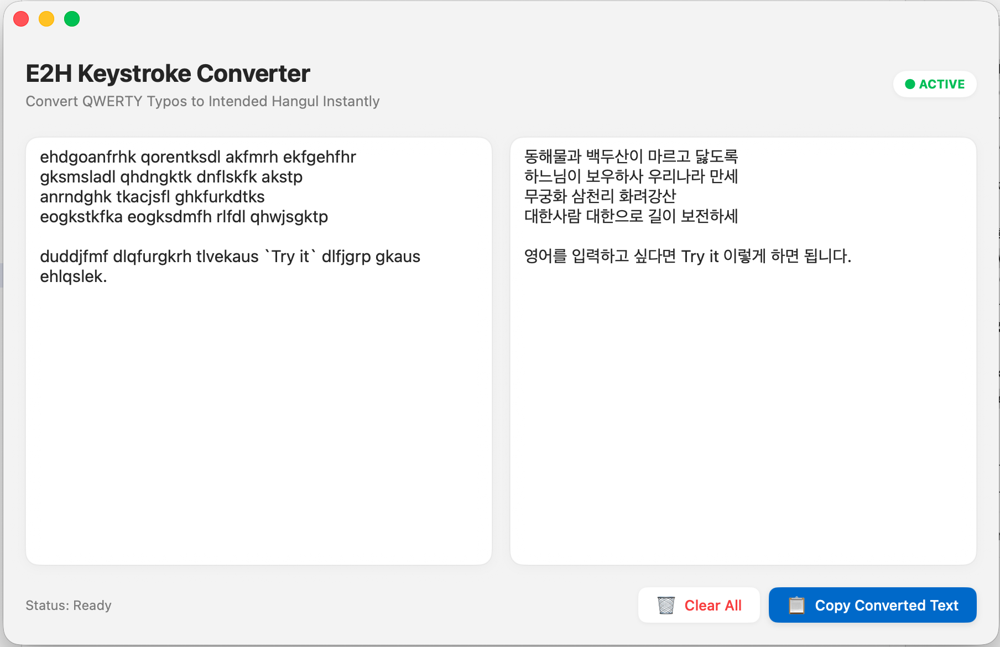

# E2H

E2H은 OS에서 한글 입력이 불가능 하더라도 한글로 출력해주는 Mac 전용 번역 애플리케이션입니다.
원격 접속시 한글 입력기 사용이 불편할 때 유용합니다.

## 데모 (Demo)

## 설치 방법 (Installation)

1. [Releases](https://github.com/mrahn80/E2HTranslatorMac/releases) 페이지에서 최신 `.dmg` 파일을 다운로드합니다.
2. 다운로드한 `E2H.dmg` 파일을 엽니다.
3. 앱 아이콘을 `Applications(응용 프로그램)` 폴더로 드래그하여 설치합니다.
4. Launchpad 또는 응용 프로그램 폴더에서 앱을 실행합니다.

## 개발 환경 (Development)

* macOS 13.0+
* Xcode & Swift 5.0
* XcodeGen을 활용한 프로젝트 관리 (`project.yml`)

## 라이선스 (License)

이 프로젝트는 MIT 라이선스 하에 배포됩니다.
